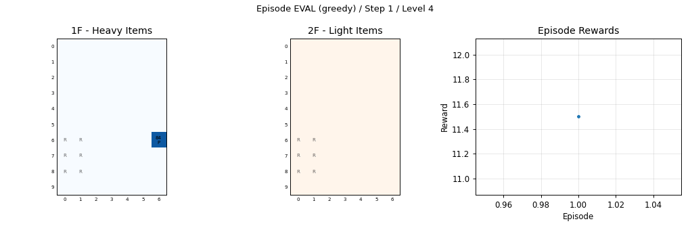
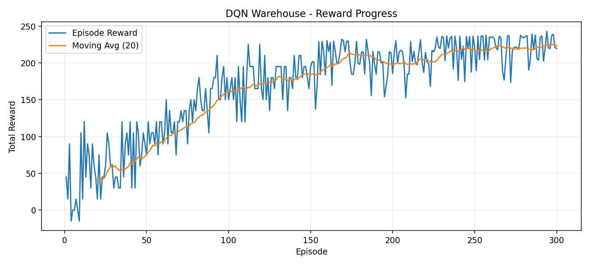
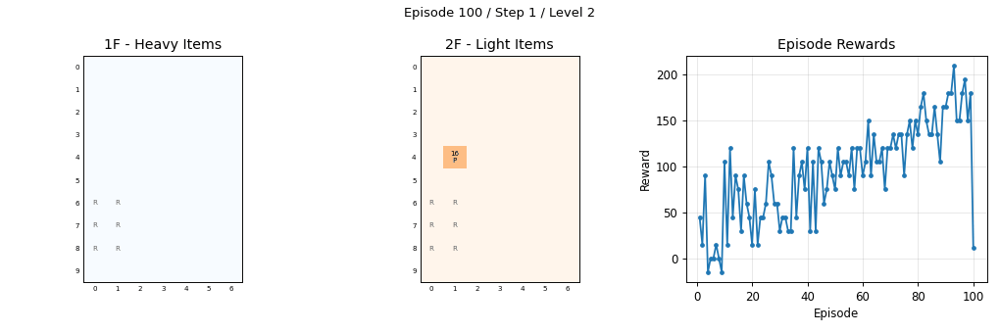

# DQN 기반 물류창고 배치 시뮬레이션

**개인 프로젝트 · 이승열 · 2024.12.02 - 2024.12.20**

2층 창고의 적재 상태와 물품 속성을 입력으로 받아 DQN이 빈 슬롯을 선택하는 강화학습 시뮬레이션입니다. 주문 데이터 전처리, 창고 환경, 보상 함수, DQN 에이전트와 배치 시각화를 구현했습니다.

## 설계 및 구현

| 항목 | 구현 |
|---|---|
| 창고 환경 | 2층, 각 층 10×7 격자, 통로를 제외한 층별 적재 후보 33개 |
| 관측값 | 두 층의 적재 상태 140개와 물품 속성·진행 상태 6개, 총 146개 |
| 행동 | 무게 규칙으로 층을 결정한 뒤 DQN이 해당 층의 빈 슬롯 선택 |
| 신경망 | NumPy 기반 146 → 64 → 64 → 33, 후보별 Q값 계산 |
| 학습 | epsilon-greedy, 경험 재생 메모리 12,000개, 타깃 네트워크 |
| 보상 | 물품 종류, 중량 조건, 반품 수량, 단가 조건을 4단계로 추가 |
| 적재 제어 | 점유 슬롯을 행동 마스크로 제외, 한 칸에 한 물품 배치 |

CSV·Excel 주문의 SKU와 상품 유형별 수량을 집계하고 단가에는 중앙값을 사용합니다. 음수 수량 또는 취소 송장은 반품으로 구분합니다. 주문에 없는 무게·높이·폭은 시뮬레이션 속성으로 생성하며, 현재 환경은 무게를 사용합니다. 무게는 가상 단위 1~100이고, 50 초과는 1층, 50 이하는 2층으로 배치합니다.

## 학습·배치 화면

300 에피소드, 에피소드당 최대 30회 배치의 학습 기록입니다. P는 일반 물품, R은 반품을 나타냅니다.





<details>
<summary>100·200·300회 학습 시점의 배치 과정</summary>



</details>

학습 중 단계별로 보상 조건을 추가합니다. 그래프는 각 단계의 보상 기록이며, 정책 비교는 아래와 같이 보상 조건을 고정한 평가에서 수행합니다.

## 샘플 데이터 평가

`examples/demo/`의 16회 학습 모델을 기능 점검용 임의 주문 데이터로 평가한 결과입니다. 위 300회 학습 화면과는 별도의 실행입니다.

| 조건 | 설정 |
|---|---|
| 학습 | 16 에피소드, 최대 20회 배치, seed 42 |
| 평가 | 60 에피소드, 4단계 보상 고정, 최대 20회 배치, seed 1042 |
| 비교 | 동일한 물품 순서에서 greedy 정책과 무작위 배치 |

| 지표 | 학습 정책 | 무작위 배치 |
|---|---:|---:|
| 평균 보상 | 117.900 | 30.122 |
| 일반 물품·반품 구역 일치율 | 77.25% | 48.83% |

[평가 기록](examples/demo/history/evaluation.json) · [학습 설정](examples/demo/history/training_summary.json)

## 실행

Python 3.10 이상 환경에서 프로젝트 폴더로 이동합니다. NumPy 기반 실행 코드에는 TensorFlow가 필요하지 않습니다.

```bash
cd AI/warehouse-dqn
python -m pip install -r requirements.txt
python run_demo.py --episodes 16 --max-steps 20 --gif-every 8 --eval-episodes 60
```

`run_demo.py`는 임의 주문 데이터를 생성한 뒤 전처리, 학습, 그래프·GIF 저장과 정책 평가를 실행합니다. 실행 결과는 `output/demo/`에 저장합니다.

저장된 샘플 모델만 평가하려면 다음 명령을 사용합니다.

```bash
python evaluate.py --data data/Combined_States_sample.json --model examples/demo/dqn_weights.npz --episodes 60 --max-steps 20 --seed 1042
```

CSV·Excel 주문 데이터를 사용한 학습은 다음과 같이 실행합니다.

```bash
python preprocessing.py --input data/OnlineRetail.xlsx --output data/Combined_States.json
python train.py --data data/Combined_States.json --episodes 300 --max-steps 30 --gif-every 75
python evaluate.py --data data/Combined_States.json --model output/dqn_weights.npz
```

입력 파일에는 `InvoiceNo`, `StockCode`, `Description`, `Quantity`, `UnitPrice` 열이 필요합니다.

## 코드 구성

| 파일 | 역할 |
|---|---|
| `preprocessing.py` | 주문 데이터 정제와 물품 속성 구성 |
| `warehouse_env.py` | 관측값, 빈 슬롯, 적재 상태와 보상 계산 |
| `dqn_agent.py` | Q 네트워크, 경험 재생, 가중치 갱신·저장 |
| `train.py` / `evaluate.py` | 학습과 동일 조건의 정책 비교 |
| `visualization.py` | 보상 그래프와 층별 배치 GIF 생성 |
| `create_sample_data.py` / `run_demo.py` | 샘플 데이터 생성과 통합 실행 |
| `test_warehouse.py` | 환경·전처리·DQN·출력 생성 시험 |
| `legacy/warehouse_dqn_initial.py` | TensorFlow 기반 초기 실험 스크립트 |

## 검증

관측·행동 크기, 물품 속성, 배치 보상, 점유 슬롯 처리, 반품 전처리, 가중치 갱신·저장과 학습 결과 생성을 확인하는 자동 시험 **7개 PASS**입니다.

```bash
python -m pytest test_warehouse.py -q
```

## 발표·설계 자료

- [발표자료 PPT](docs/warehouse-presentation.pptx)
- [발표자료 미리보기](docs/warehouse-presentation.pdf)
- [설계 보고서](docs/warehouse-report.pdf)

발표·보고서는 초기 설계의 보상 조건과 학습 기록을 담았습니다. NumPy 실행 코드의 설정과 평가 조건은 위 표에 정리했습니다.

## 향후 과제

같은 보상 기준에서 여러 시드와 규칙 기반 배치를 비교하고, 주문 날짜·출고 순서와 물품의 길이·폭·높이를 환경에 반영하는 방향으로 확장합니다.
